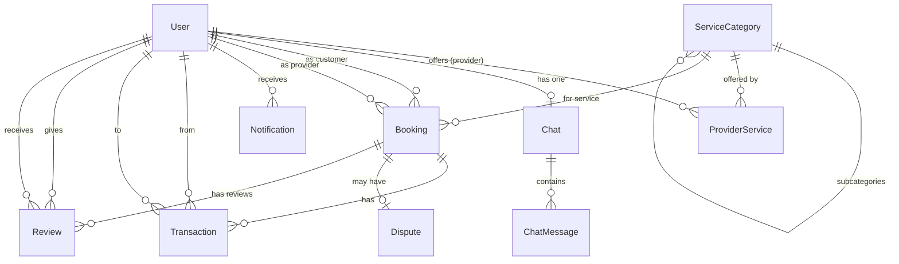

# Services AI App — Final Prisma Schema (v3)

All questions resolved. Schema is ready for implementation approval.

---

## Complete Schema

```prisma
// prisma/schema.prisma

generator client {
  provider = "prisma-client-js"
}

datasource db {
  provider = "mongodb"
  url      = env("DATABASE_URL")
}

// ==================== ENUMS ====================

enum UserRole {
  CUSTOMER
  PROVIDER
}

enum BookingStatus {
  UNPAID
  PENDING
  INITIALIZED
  PROVIDER_COMPLETED
  COMPLETED
  DISPUTED
  CANCELLED
}

enum CancelledBy {
  CUSTOMER
  PROVIDER
}

enum TransactionType {
  PAYMENT
  REFUND
  PROVIDER_PAYOUT
  PLATFORM_FEE
}

enum TransactionStatus {
  SUCCESS
  FAILED
  ON_HOLD
}

enum NotificationType {
  NEW_BOOKING
  BOOKING_INITIALIZED
  BOOKING_COMPLETED
  BOOKING_CANCELLED
  BOOKING_DISPUTED
  PAYMENT_RECEIVED
  GENERAL
}

enum ChatMessageRole {
  USER
  ASSISTANT
  SYSTEM
}

enum MessageContentType {
  TEXT
  PROVIDER_LIST
  BOOKING_SUMMARY
  PAYMENT_REQUEST
  BOOKING_STATUS
}

enum DisputeStatus {
  OPEN
  RESOLVED
  CLOSED
}

enum AIMemoryStep {
  GATHERING_INFO
  SEARCHING_PROVIDERS
  AWAITING_SELECTION
  AWAITING_PAYMENT
  BOOKING_CREATED
  AWAITING_COMPLETION
  COMPLETED
}

// ==================== EMBEDDED TYPES ====================

type GeoPoint {
  type        String   @default("Point")
  coordinates Float[]  // [longitude, latitude]
}

type Location {
  address   String
  city      String
  state     String?
  country   String    @default("PK")
  geo       GeoPoint
}

type Availability {
  dayOfWeek Int       // 0=Sunday ... 6=Saturday
  startTime String    // "09:00" (HH:mm)
  endTime   String    // "17:00" (HH:mm)
}

type MemoryLocation {
  address   String?
  city      String?
  geo       MemoryGeoPoint?
}

type MemoryGeoPoint {
  type        String?  @default("Point")
  coordinates Float[]
}

// ==================== MODELS ====================

// --- User (unified for Customer & Provider) ---

model User {
  id            String    @id @default(auto()) @map("_id") @db.ObjectId
  email         String    @unique
  password      String
  firstName     String
  lastName      String
  phone         String?
  role          UserRole
  avatarUrl     String?
  fcmToken      String?
  creditBalance Float     @default(0)
  location      Location

  // Provider-only fields (null for customers)
  bio           String?
  experience    Int?
  rating        Float?    @default(0)
  totalJobs     Int?      @default(0)
  serviceRadius Float?              // Max km willing to travel
  availability  Availability[]
  isVerified    Boolean?  @default(false)
  providerServices ProviderService[]

  // Relations
  bookingsAsCustomer Booking[]       @relation("CustomerBookings")
  bookingsAsProvider Booking[]       @relation("ProviderBookings")
  chat               Chat?
  notifications      Notification[]
  transactionsFrom   Transaction[]   @relation("TransactionFrom")
  transactionsTo     Transaction[]   @relation("TransactionTo")
  reviewsGiven       Review[]        @relation("ReviewsGiven")
  reviewsReceived    Review[]        @relation("ReviewsReceived")

  isActive    Boolean   @default(true)
  createdAt   DateTime  @default(now())
  updatedAt   DateTime  @updatedAt

  @@map("users")
}

// --- ServiceCategory (2-level hierarchy) ---

model ServiceCategory {
  id          String   @id @default(auto()) @map("_id") @db.ObjectId
  name        String
  description String?
  icon        String?

  parentId    String?           @db.ObjectId
  parent      ServiceCategory?  @relation("SubCategories", fields: [parentId], references: [id], onDelete: NoAction, onUpdate: NoAction)
  children    ServiceCategory[] @relation("SubCategories")

  providerServices ProviderService[]
  bookings         Booking[]

  isActive    Boolean  @default(true)
  createdAt   DateTime @default(now())
  updatedAt   DateTime @updatedAt

  @@map("service_categories")
}

// --- ProviderService (links provider to their offered services with pricing) ---

model ProviderService {
  id          String          @id @default(auto()) @map("_id") @db.ObjectId
  providerId  String          @db.ObjectId
  provider    User            @relation(fields: [providerId], references: [id])
  categoryId  String          @db.ObjectId
  category    ServiceCategory @relation(fields: [categoryId], references: [id])

  minPrice    Float
  maxPrice    Float
  description String?

  createdAt   DateTime @default(now())
  updatedAt   DateTime @updatedAt

  @@unique([providerId, categoryId])
  @@map("provider_services")
}

// --- Booking (core lifecycle entity) ---

model Booking {
  id                String        @id @default(auto()) @map("_id") @db.ObjectId

  customerId        String        @db.ObjectId
  customer          User          @relation("CustomerBookings", fields: [customerId], references: [id])

  providerId        String        @db.ObjectId
  provider          User          @relation("ProviderBookings", fields: [providerId], references: [id])

  categoryId        String        @db.ObjectId
  category          ServiceCategory @relation(fields: [categoryId], references: [id])

  status            BookingStatus @default(UNPAID)
  serviceDetails    String
  customerNotes     String?
  scheduledAt       DateTime
  estimatedDuration Int?          // Duration in minutes, set by AI
  location          Location

  // Pricing (determined by AI)
  totalAmount       Float
  platformFee       Float?        // 5%, calculated on completion
  providerPayout    Float?        // 95%, calculated on completion

  // AI matching
  matchReasoning    String?

  // Cancellation
  cancelledBy       CancelledBy?

  // Lifecycle timestamps
  paidAt            DateTime?
  initializedAt     DateTime?
  completedAt       DateTime?
  cancelledAt       DateTime?
  disputedAt        DateTime?

  // Relations
  transactions      Transaction[]
  dispute           Dispute?
  reviews           Review[]

  createdAt         DateTime @default(now())
  updatedAt         DateTime @updatedAt

  @@map("bookings")
}

// --- Transaction (mock payment records) ---

model Transaction {
  id          String            @id @default(auto()) @map("_id") @db.ObjectId

  bookingId   String            @db.ObjectId
  booking     Booking           @relation(fields: [bookingId], references: [id])

  fromUserId  String?           @db.ObjectId  // null = platform
  fromUser    User?             @relation("TransactionFrom", fields: [fromUserId], references: [id])

  toUserId    String?           @db.ObjectId  // null = platform
  toUser      User?             @relation("TransactionTo", fields: [toUserId], references: [id])

  amount      Float
  type        TransactionType
  status      TransactionStatus @default(SUCCESS)
  description String?

  createdAt   DateTime @default(now())
  updatedAt   DateTime @updatedAt

  @@map("transactions")
}

// --- Review (mutual: customer ↔ provider after booking completion) ---

model Review {
  id           String   @id @default(auto()) @map("_id") @db.ObjectId

  bookingId    String   @db.ObjectId
  booking      Booking  @relation(fields: [bookingId], references: [id])

  reviewerId   String   @db.ObjectId
  reviewer     User     @relation("ReviewsGiven", fields: [reviewerId], references: [id])

  revieweeId   String   @db.ObjectId
  reviewee     User     @relation("ReviewsReceived", fields: [revieweeId], references: [id])

  rating       Int                // 1-5 stars
  comment      String?

  createdAt    DateTime @default(now())
  updatedAt    DateTime @updatedAt

  @@unique([bookingId, reviewerId])   // One review per person per booking
  @@map("reviews")
}

// --- Dispute (raised when customer rejects provider completion) ---

model Dispute {
  id         String        @id @default(auto()) @map("_id") @db.ObjectId

  bookingId  String        @unique @db.ObjectId
  booking    Booking       @relation(fields: [bookingId], references: [id])

  reason     String
  status     DisputeStatus @default(OPEN)
  resolution String?

  createdAt  DateTime @default(now())
  updatedAt  DateTime @updatedAt

  @@map("disputes")
}

// --- Chat (one per customer) ---

model Chat {
  id        String        @id @default(auto()) @map("_id") @db.ObjectId

  userId    String        @unique @db.ObjectId
  user      User          @relation(fields: [userId], references: [id])

  messages  ChatMessage[]

  createdAt DateTime @default(now())
  updatedAt DateTime @updatedAt

  @@map("chats")
}

// --- ChatMessage (supports rich content via contentType + metadata) ---

model ChatMessage {
  id            String             @id @default(auto()) @map("_id") @db.ObjectId

  chatId        String             @db.ObjectId
  chat          Chat               @relation(fields: [chatId], references: [id])

  role          ChatMessageRole
  content       String
  contentType   MessageContentType @default(TEXT)
  metadata      String?            // JSON: full provider details, booking summary, etc.

  // AI internals
  toolCalls     String?            // JSON: tool calls
  toolResults   String?            // JSON: tool results

  createdAt     DateTime @default(now())
  updatedAt     DateTime @updatedAt

  @@map("chat_messages")
}

// --- AIMemory (one per booking intent, tracks current draft) ---

model AIMemory {
  id                 String        @id @default(auto()) @map("_id") @db.ObjectId

  userId             String        @db.ObjectId
  chatId             String        @db.ObjectId

  currentStep        AIMemoryStep  @default(GATHERING_INFO)

  serviceCategory    String?
  subCategory        String?
  serviceDetails     String?
  scheduledDate      String?
  scheduledTime      String?
  estimatedDuration  Int?          // minutes
  estimatedPrice     Float?        // AI-determined price
  location           MemoryLocation?

  categoryId         String?       @db.ObjectId
  selectedProviderId String?       @db.ObjectId

  providerOptions    String?       // JSON: full provider details + reasoning

  isActive           Boolean  @default(true)
  isConfirmed        Boolean  @default(false)
  bookingId          String?  @db.ObjectId

  createdAt          DateTime @default(now())
  updatedAt          DateTime @updatedAt

  @@map("ai_memories")
}

// --- Notification ---

model Notification {
  id        String           @id @default(auto()) @map("_id") @db.ObjectId

  userId    String           @db.ObjectId
  user      User             @relation(fields: [userId], references: [id])

  type      NotificationType
  title     String
  body      String
  data      String?          // JSON payload
  isRead    Boolean          @default(false)

  createdAt DateTime @default(now())
  updatedAt DateTime @updatedAt

  @@map("notifications")
}
```

---

## Models Summary

| # | Model | Purpose |
|---|---|---|
| 1 | User | Unified customer/provider with role-based fields |
| 2 | ServiceCategory | 2-level hierarchy (category → subcategory) |
| 3 | ProviderService | Links provider to services with min/max pricing |
| 4 | Booking | Full lifecycle from UNPAID → COMPLETED/DISPUTED/CANCELLED |
| 5 | Transaction | Mock payment records, null user = platform |
| 6 | Review | Mutual reviews (customer ↔ provider) after completion |
| 7 | Dispute | Customer disputes provider's completion claim |
| 8 | Chat | One persistent chat per customer |
| 9 | ChatMessage | Rich content messages with metadata JSON |
| 10 | AIMemory | Per-booking-intent memory with step tracking |
| 11 | Notification | In-app notifications for both roles |

## Embedded Types Summary

| Type | Used In | Purpose |
|---|---|---|
| GeoPoint | Location | GeoJSON `[lng, lat]` for MongoDB 2dsphere queries |
| Location | User, Booking | Full address + geo coordinates |
| Availability | User | Provider weekly schedule (day + time slots) |
| MemoryLocation | AIMemory | Partial location during booking draft |
| MemoryGeoPoint | MemoryLocation | Optional geo during draft |

## Relationship Diagram



## GeoJSON Index (post-push)

```javascript
// Run after prisma db push
db.users.createIndex({ "location.geo": "2dsphere" });
db.bookings.createIndex({ "location.geo": "2dsphere" });
```

## Transaction Flow

| Scenario | fromUserId | toUserId | Type |
|---|---|---|---|
| Customer pays | customerId | null (platform) | PAYMENT |
| Cancellation refund | null (platform) | customerId | REFUND |
| Provider payout (95%) | null (platform) | providerId | PROVIDER_PAYOUT |
| Platform fee (5%) | null | null (platform) | PLATFORM_FEE |
