# Services AI — Complete System Design

> **For best diagram rendering, view this file at [https://markdownviewer.pages.dev](https://markdownviewer.pages.dev)**

---

## Table of Contents

1. [Overview](#overview)
2. [High-Level Architecture](#high-level-architecture)
3. [Backend Architecture](#backend-architecture)
4. [AI Agent Design](#ai-agent-design)
5. [Data Model](#data-model)
6. [Frontend Architecture](#frontend-architecture)
7. [Key Flows](#key-flows)
8. [Known Flaws & Limitations](#known-flaws--limitations)

---

## Overview

Services AI is a mobile-first SaaS platform that connects **Customers** (who need home/professional services) with **Providers** (who fulfill them). The entire customer-facing booking journey — from describing a need to reviewing the completed job — is orchestrated by an **AI conversational agent** running in real-time over WebSocket. Providers interact via a standard REST API.

---

## High-Level Architecture

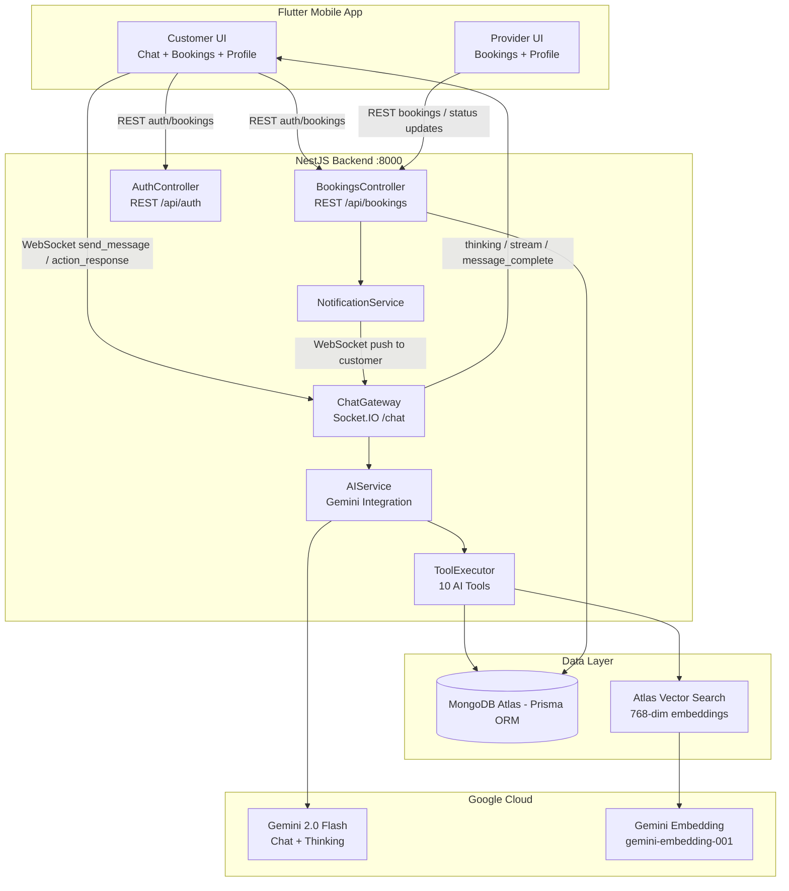
```mermaid
graph TB
    subgraph Flutter["Flutter Mobile App"]
        CU["Customer UI<br/>Chat + Bookings + Profile"]
        PU["Provider UI<br/>Bookings + Profile"]
    end

    subgraph NestJS["NestJS Backend :8000"]
        GW["ChatGateway<br/>Socket.IO /chat"]
        BC["BookingsController<br/>REST /api/bookings"]
        AC["AuthController<br/>REST /api/auth"]
        AI["AIService<br/>Gemini Integration"]
        TE["ToolExecutor<br/>10 AI Tools"]
        NS[NotificationService]
    end

    subgraph Data["Data Layer"]
        MDB[("MongoDB Atlas - Prisma ORM")]
        VS["Atlas Vector Search<br/>768-dim embeddings"]
    end

    subgraph Google["Google Cloud"]
        GEM["Gemini 2.0 Flash<br/>Chat + Thinking"]
        EMB["Gemini Embedding<br/>gemini-embedding-001"]
    end

    CU -- "WebSocket send_message / action_response" --> GW
    CU -- "REST auth/bookings" --> AC
    CU -- "REST auth/bookings" --> BC
    PU -- "REST bookings / status updates" --> BC
    GW --> AI
    AI --> GEM
    AI --> TE
    TE --> MDB
    TE --> VS
    VS --> EMB
    BC --> MDB
    BC --> NS
    NS -- "WebSocket push to customer" --> GW
    GW -- "thinking / stream / message_complete" --> CU
```

---

## Backend Architecture

### Module Structure

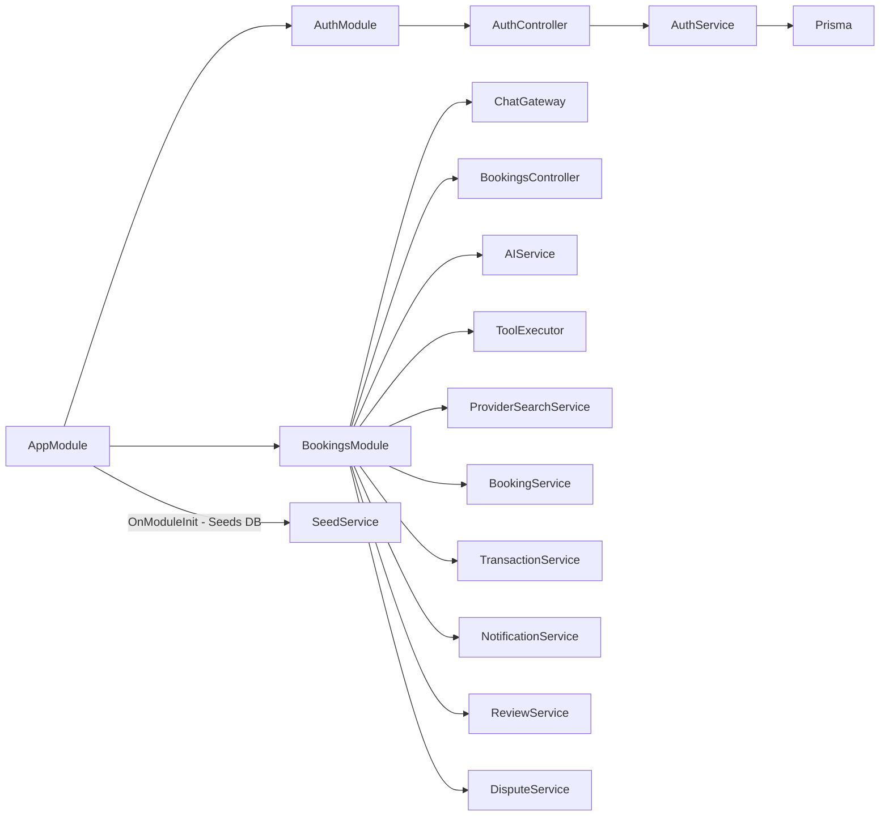
```mermaid
graph LR
    AppModule --> AuthModule
    AppModule --> BookingsModule
    AppModule -- "OnModuleInit - Seeds DB" --> SeedService

    AuthModule --> AuthController
    AuthController --> AuthService
    AuthService --> Prisma

    BookingsModule --> ChatGateway
    BookingsModule --> BookingsController
    BookingsModule --> AIService
    BookingsModule --> ToolExecutor
    BookingsModule --> ProviderSearchService
    BookingsModule --> BookingService
    BookingsModule --> TransactionService
    BookingsModule --> NotificationService
    BookingsModule --> ReviewService
    BookingsModule --> DisputeService
```

### Guards & Auth Decorators

| Decorator / Guard           | Scope  | Purpose                           |
| --------------------------- | ------ | --------------------------------- |
| `JwtAuthGuard`              | Global | All routes require JWT by default |
| `RolesGuard`                | Global | Checks `@Roles()` metadata        |
| `@Public()`                 | Route  | Skips JWT (signup, login)         |
| `@Roles(UserRole.PROVIDER)` | Route  | RBAC enforcement                  |
| `@GetUser('sub')`           | Param  | Extracts userId from JWT payload  |

### REST Endpoints

| Endpoint                   | Method | Auth     | Description                                      |
| -------------------------- | ------ | -------- | ------------------------------------------------ |
| `/api/auth/signup`         | POST   | Public   | Register customer or provider                    |
| `/api/auth/login`          | POST   | Public   | Login → JWT + user                               |
| `/api/auth/me`             | GET    | JWT      | Current user profile                             |
| `/api/auth/me`             | PATCH  | JWT      | Update profile (name, bio, phone, isActive)      |
| `/api/bookings`            | GET    | JWT      | List bookings (role-filtered)                    |
| `/api/bookings/:id`        | GET    | JWT      | Single booking details                           |
| `/api/bookings/:id/status` | PATCH  | Provider | Set INITIALIZED / PROVIDER_COMPLETED / CANCELLED |
| `/api/bookings/:id/pay`    | POST   | Customer | Mock payment                                     |
| `/api/bookings/:id/review` | POST   | JWT      | Submit review (one per party)                    |

### WebSocket Gateway

Token accepted from **3 sources** on connect:

1. `handshake.auth.token`
2. `Authorization` header
3. `?token=` query param

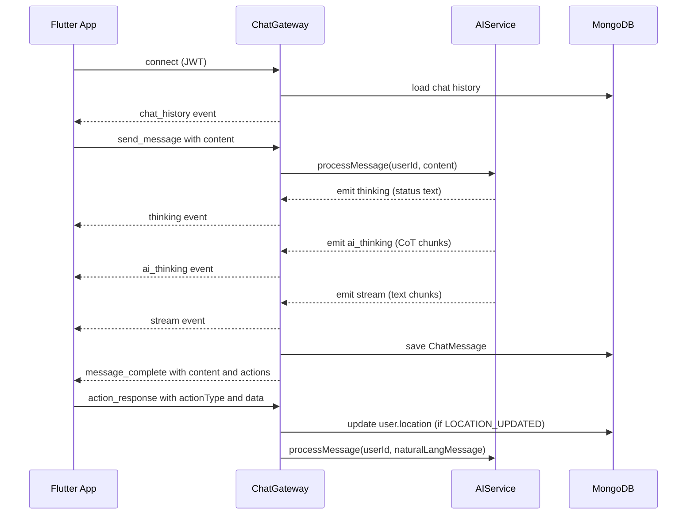
```mermaid
sequenceDiagram
    participant App as Flutter App
    participant GW as ChatGateway
    participant AI as AIService
    participant DB as MongoDB

    App->>GW: connect (JWT)
    GW->>DB: load chat history
    GW-->>App: chat_history event

    App->>GW: send_message with content
    GW->>AI: processMessage(userId, content)
    AI-->>GW: emit thinking (status text)
    GW-->>App: thinking event
    AI-->>GW: emit ai_thinking (CoT chunks)
    GW-->>App: ai_thinking event
    AI-->>GW: emit stream (text chunks)
    GW-->>App: stream event
    GW->>DB: save ChatMessage
    GW-->>App: message_complete with content and actions

    App->>GW: action_response with actionType and data
    GW->>DB: update user.location (if LOCATION_UPDATED)
    GW->>AI: processMessage(userId, naturalLangMessage)
```

---

## AI Agent Design

### Processing Pipeline

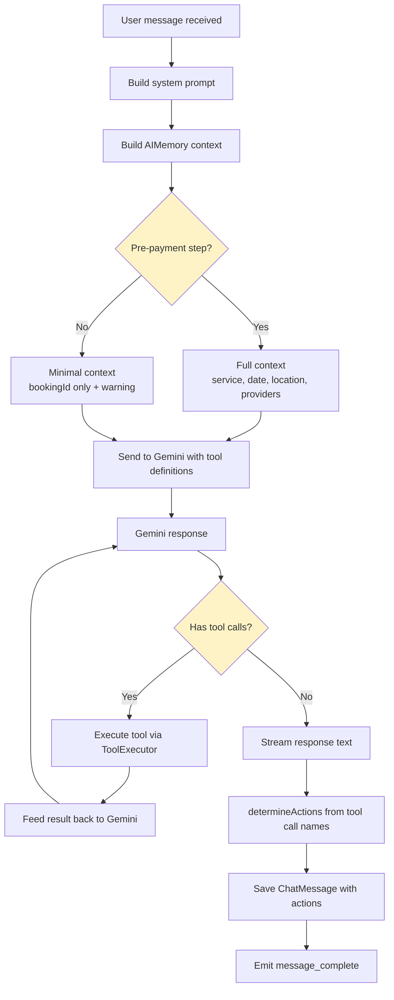
```mermaid
flowchart TD
    A[User message received] --> B[Build system prompt]
    B --> C[Build AIMemory context]
    C --> D{Pre-payment step?}
    D -- Yes --> E["Full context<br/>service, date, location, providers"]
    D -- No --> F["Minimal context<br/>bookingId only + warning"]
    E --> G[Send to Gemini with tool definitions]
    F --> G
    G --> H[Gemini response]
    H --> I{Has tool calls?}
    I -- Yes --> J[Execute tool via ToolExecutor]
    J --> K[Feed result back to Gemini]
    K --> H
    I -- No --> L[Stream response text]
    L --> M[determineActions from tool call names]
    M --> N[Save ChatMessage with actions]
    N --> O[Emit message_complete]

    style D fill:#fef3c7
    style I fill:#fef3c7
```

### Tool Calling Loop (max 10 iterations)

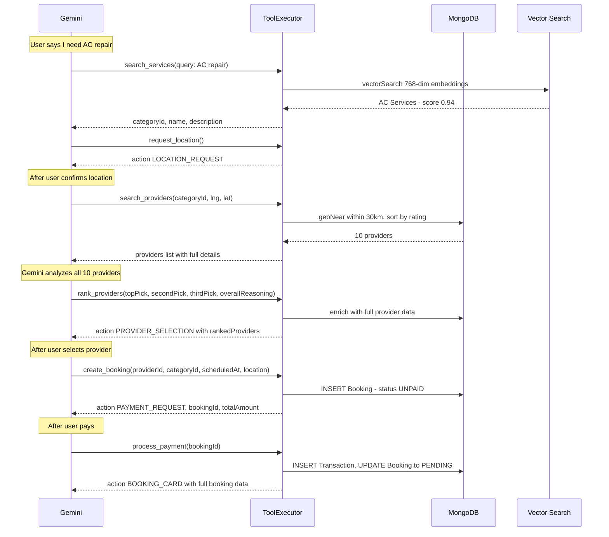
```mermaid
sequenceDiagram
    participant AI as Gemini
    participant TE as ToolExecutor
    participant DB as MongoDB
    participant VS as Vector Search

    Note over AI: User says I need AC repair
    AI->>TE: search_services(query: AC repair)
    TE->>VS: vectorSearch 768-dim embeddings
    VS-->>TE: AC Services - score 0.94
    TE-->>AI: categoryId, name, description

    AI->>TE: request_location()
    TE-->>AI: action LOCATION_REQUEST

    Note over AI: After user confirms location
    AI->>TE: search_providers(categoryId, lng, lat)
    TE->>DB: geoNear within 30km, sort by rating
    DB-->>TE: 10 providers
    TE-->>AI: providers list with full details

    Note over AI: Gemini analyzes all 10 providers
    AI->>TE: rank_providers(topPick, secondPick, thirdPick, overallReasoning)
    TE->>DB: enrich with full provider data
    TE-->>AI: action PROVIDER_SELECTION with rankedProviders

    Note over AI: After user selects provider
    AI->>TE: create_booking(providerId, categoryId, scheduledAt, location)
    TE->>DB: INSERT Booking - status UNPAID
    TE-->>AI: action PAYMENT_REQUEST, bookingId, totalAmount

    Note over AI: After user pays
    AI->>TE: process_payment(bookingId)
    TE->>DB: INSERT Transaction, UPDATE Booking to PENDING
    TE-->>AI: action BOOKING_CARD with full booking data
```

### Provider Discovery Flow

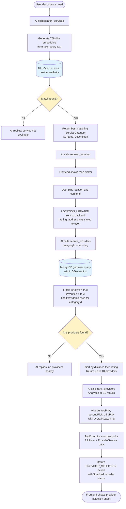
```mermaid
flowchart TD
    A([User describes a need]) --> B[AI calls search_services]
    B --> C[Generate 768-dim embedding\nfrom user query text]
    C --> D[(Atlas Vector Search\ncosine similarity)]
    D --> E{Match found?}
    E -- No --> F[AI replies: service not available]
    E -- Yes --> G[Return best matching ServiceCategory\nid, name, description]

    G --> H[AI calls request_location]
    H --> I[Frontend shows map picker]
    I --> J[User pins location and confirms]
    J --> K[LOCATION_UPDATED sent to backend\nlat, lng, address, city saved to user]

    K --> L[AI calls search_providers\ncategoryId + lat + lng]
    L --> M[(MongoDB geoNear query\nwithin 30km radius)]
    M --> N[Filter: isActive = true\nisVerified = true\nhas ProviderService for categoryId]
    N --> O{Any providers found?}
    O -- No --> P[AI replies: no providers nearby]
    O -- Yes --> Q[Sort by distance then rating\nReturn up to 10 providers]

    Q --> R[AI calls rank_providers\nAnalyses all 10 results]
    R --> S[AI picks topPick, secondPick, thirdPick\nwith overallReasoning]
    S --> T[ToolExecutor enriches picks\nfull User + ProviderService data]
    T --> U[Return PROVIDER_SELECTION action\nwith 3 ranked provider cards]
    U --> V([Frontend shows provider selection sheet])

    style D fill:#e0f2fe
    style M fill:#e0f2fe
    style E fill:#fef3c7
    style O fill:#fef3c7
```

### AI Tools Reference

| #   | Tool                 | Input                                                    | Output / Side Effect                                         |
| --- | -------------------- | -------------------------------------------------------- | ------------------------------------------------------------ |
| 1   | `search_services`    | `{ query }`                                              | Vector → category match; resets AIMemory if post-payment     |
| 2   | `search_providers`   | `{ categoryId, lng, lat }`                               | 10 providers within 30km via `$geoNear`                      |
| 3   | `rank_providers`     | `{ topPick, secondPick, thirdPick, overallReasoning }`   | Builds `PROVIDER_SELECTION` action                           |
| 4   | `create_booking`     | `{ providerId, categoryId, scheduledAt, location, ... }` | Creates `Booking` (UNPAID); AIMemory → `AWAITING_PAYMENT`    |
| 5   | `process_payment`    | `{ bookingId }`                                          | Mock transaction; Booking → `PENDING`; builds `BOOKING_CARD` |
| 6   | `confirm_completion` | `{ bookingId }`                                          | Booking → `COMPLETED`; 95/5 payout split                     |
| 7   | `create_dispute`     | `{ bookingId, reason }`                                  | Booking → `DISPUTED`; payment `ON_HOLD`                      |
| 8   | `find_booking`       | `{ bookingId?, status? }`                                | Returns customer's bookings with full location data          |
| 9   | `submit_review`      | `{ bookingId, rating, comment? }`                        | Creates Review; recalculates provider avg rating             |
| 10  | `request_location`   | _(none)_                                                 | Triggers `LOCATION_REQUEST` action widget on frontend        |

### AIMemory State Machine

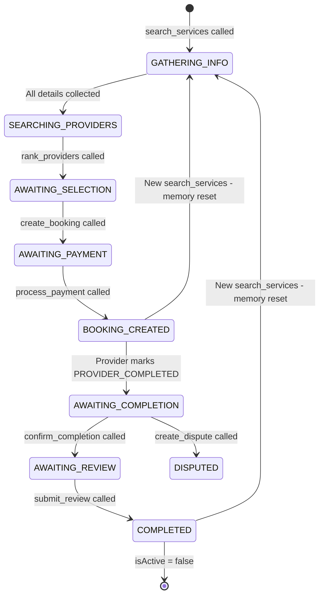
```mermaid
stateDiagram-v2
    [*] --> GATHERING_INFO: search_services called
    GATHERING_INFO --> SEARCHING_PROVIDERS: All details collected
    SEARCHING_PROVIDERS --> AWAITING_SELECTION: rank_providers called
    AWAITING_SELECTION --> AWAITING_PAYMENT: create_booking called
    AWAITING_PAYMENT --> BOOKING_CREATED: process_payment called
    BOOKING_CREATED --> AWAITING_COMPLETION: Provider marks PROVIDER_COMPLETED
    AWAITING_COMPLETION --> AWAITING_REVIEW: confirm_completion called
    AWAITING_COMPLETION --> DISPUTED: create_dispute called
    AWAITING_REVIEW --> COMPLETED: submit_review called
    COMPLETED --> [*]: isActive = false

    BOOKING_CREATED --> GATHERING_INFO: New search_services - memory reset
    COMPLETED --> GATHERING_INFO: New search_services - memory reset
```

**Memory Reset Rule:** When `search_services` is called and existing `AIMemory.currentStep` is post-payment (`BOOKING_CREATED`, `AWAITING_COMPLETION`, `AWAITING_REVIEW`, `COMPLETED`), the old memory is deactivated and a fresh record created. AI must re-ask date, time, location, and notes — never carries over from prior booking.

### Context Building Strategy

| Phase                                               | What AI receives                                                                           |
| --------------------------------------------------- | ------------------------------------------------------------------------------------------ |
| Pre-payment (`GATHERING_INFO` → `AWAITING_PAYMENT`) | Full context: service details, date/time, location, gathered info, provider list           |
| Post-payment (`BOOKING_CREATED` → `COMPLETED`)      | Only `bookingId` + hard warning: "This booking is already confirmed. Do NOT re-create it." |

This prevents the AI from re-booking an already-paid booking if the user mentions the same service again.

---

## Data Model

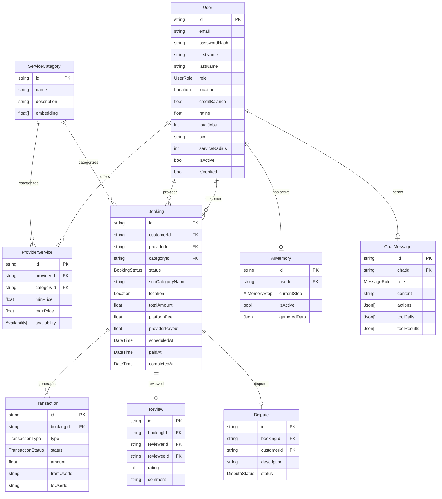
```mermaid
erDiagram
    User {
        string id PK
        string email
        string passwordHash
        string firstName
        string lastName
        UserRole role
        Location location
        float creditBalance
        float rating
        int totalJobs
        string bio
        int serviceRadius
        bool isActive
        bool isVerified
    }

    ServiceCategory {
        string id PK
        string name
        string description
        float[] embedding
    }

    ProviderService {
        string id PK
        string providerId FK
        string categoryId FK
        float minPrice
        float maxPrice
        Availability[] availability
    }

    Booking {
        string id PK
        string customerId FK
        string providerId FK
        string categoryId FK
        BookingStatus status
        string subCategoryName
        Location location
        float totalAmount
        float platformFee
        float providerPayout
        DateTime scheduledAt
        DateTime paidAt
        DateTime completedAt
    }

    Transaction {
        string id PK
        string bookingId FK
        TransactionType type
        TransactionStatus status
        float amount
        string fromUserId
        string toUserId
    }

    AIMemory {
        string id PK
        string userId FK
        AIMemoryStep currentStep
        bool isActive
        Json gatheredData
    }

    ChatMessage {
        string id PK
        string chatId FK
        MessageRole role
        string content
        Json[] actions
        Json[] toolCalls
        Json[] toolResults
    }

    Review {
        string id PK
        string bookingId FK
        string reviewerId FK
        string revieweeId FK
        int rating
        string comment
    }

    Dispute {
        string id PK
        string bookingId FK
        string customerId FK
        string description
        DisputeStatus status
    }

    User ||--o{ Booking : "customer"
    User ||--o{ Booking : "provider"
    User ||--o{ ProviderService : "offers"
    ServiceCategory ||--o{ ProviderService : "categorizes"
    ServiceCategory ||--o{ Booking : "categorizes"
    Booking ||--o{ Transaction : "generates"
    Booking ||--o| Review : "reviewed"
    Booking ||--o| Dispute : "disputed"
    User ||--o| AIMemory : "has active"
    User ||--o| ChatMessage : "sends"
```

### Booking Status Lifecycle

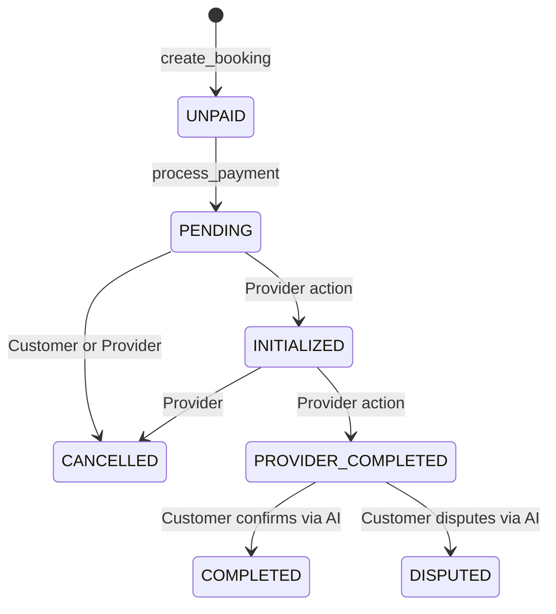
```mermaid
stateDiagram-v2
    [*] --> UNPAID: create_booking
    UNPAID --> PENDING: process_payment
    PENDING --> INITIALIZED: Provider action
    PENDING --> CANCELLED: Customer or Provider
    INITIALIZED --> PROVIDER_COMPLETED: Provider action
    INITIALIZED --> CANCELLED: Provider
    PROVIDER_COMPLETED --> COMPLETED: Customer confirms via AI
    PROVIDER_COMPLETED --> DISPUTED: Customer disputes via AI
```

### Payment Flow

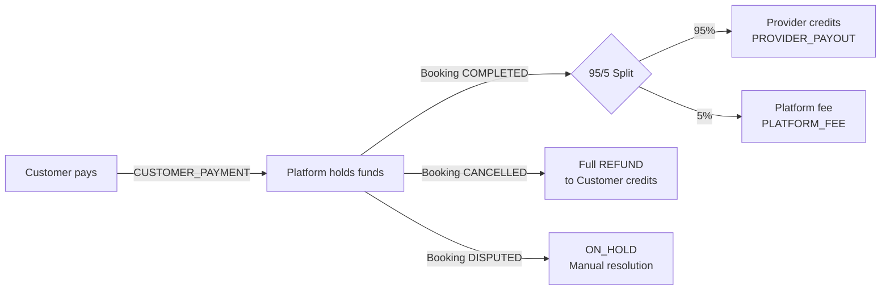
```mermaid
flowchart LR
    A[Customer pays] -->|CUSTOMER_PAYMENT| B[Platform holds funds]
    B -->|Booking COMPLETED| C{95/5 Split}
    C -->|95%| D["Provider credits<br/>PROVIDER_PAYOUT"]
    C -->|5%| E["Platform fee<br/>PLATFORM_FEE"]
    B -->|Booking CANCELLED| F["Full REFUND<br/>to Customer credits"]
    B -->|Booking DISPUTED| G["ON_HOLD<br/>Manual resolution"]
```

---

## Frontend Architecture

### App Structure

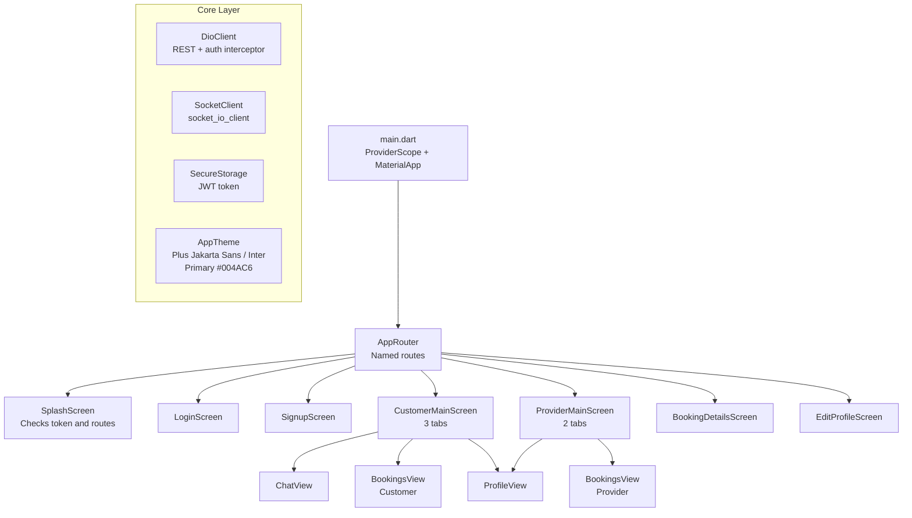
```mermaid
graph TD
    Main["main.dart<br/>ProviderScope + MaterialApp"] --> Router["AppRouter<br/>Named routes"]

    Router --> Splash["SplashScreen<br/>Checks token and routes"]
    Router --> Login[LoginScreen]
    Router --> Signup[SignupScreen]
    Router --> CM["CustomerMainScreen<br/>3 tabs"]
    Router --> PM["ProviderMainScreen<br/>2 tabs"]
    Router --> BD[BookingDetailsScreen]
    Router --> EP[EditProfileScreen]

    CM --> Chat[ChatView]
    CM --> CBV["BookingsView<br/>Customer"]
    CM --> Profile[ProfileView]

    PM --> PBV["BookingsView<br/>Provider"]
    PM --> Profile

    subgraph CoreLayer[Core Layer]
        DIO["DioClient<br/>REST + auth interceptor"]
        SOCK["SocketClient<br/>socket_io_client"]
        SS["SecureStorage<br/>JWT token"]
        Theme["AppTheme<br/>Plus Jakarta Sans / Inter<br/>Primary #004AC6"]
    end
```

### State Management (Riverpod)

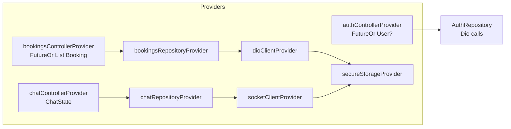
```mermaid
graph LR
    subgraph Providers
        AP["authControllerProvider<br/>FutureOr User?"]
        CP["chatControllerProvider<br/>ChatState"]
        BP["bookingsControllerProvider<br/>FutureOr List Booking"]
        RP[chatRepositoryProvider]
        BRP[bookingsRepositoryProvider]
        DIO[dioClientProvider]
        SOCK[socketClientProvider]
        SEC[secureStorageProvider]
    end

    AP --> AR["AuthRepository<br/>Dio calls"]
    CP --> RP --> SOCK
    BP --> BRP --> DIO
    DIO --> SEC
    SOCK --> SEC
```

### Chat UI — Streaming Word Timer

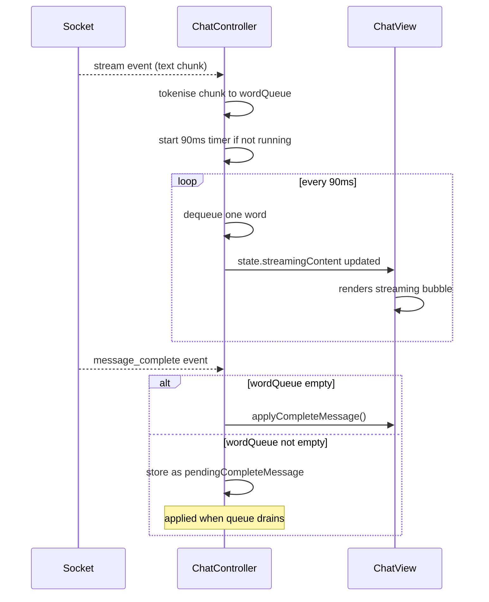
```mermaid
sequenceDiagram
    participant S as Socket
    participant C as ChatController
    participant UI as ChatView

    S-->>C: stream event (text chunk)
    C->>C: tokenise chunk to wordQueue
    C->>C: start 90ms timer if not running

    loop every 90ms
        C->>C: dequeue one word
        C->>UI: state.streamingContent updated
        UI->>UI: renders streaming bubble
    end

    S-->>C: message_complete event
    alt wordQueue empty
        C->>UI: applyCompleteMessage()
    else wordQueue not empty
        C->>C: store as pendingCompleteMessage
        Note over C: applied when queue drains
    end
```

### Action Widgets

| Widget                    | Trigger              | Behavior                                                                                                                                                      |
| ------------------------- | -------------------- | ------------------------------------------------------------------------------------------------------------------------------------------------------------- |
| `ProviderSelectionAction` | `PROVIDER_SELECTION` | "View Providers" → `DraggableScrollableSheet` with 3 cards                                                                                                    |
| `PaymentRequestAction`    | `PAYMENT_REQUEST`    | Pay button → `action_response { PAY }`                                                                                                                        |
| `BookingInfoCard`         | `BOOKING_CARD`       | Read-only: category, status badge, provider, date, location, amount, paidAt                                                                                   |
| `LocationRequestAction`   | `LOCATION_REQUEST`   | "Confirm on Map" → bottom sheet (88% height, `enableDrag: false`) → GPS auto-center → tap-to-pin → reverse geocoding → `action_response { LOCATION_UPDATED }` |
| `ConfirmCompletionAction` | `CONFIRM_COMPLETION` | Confirm ✓ or Dispute ✗ (dispute requires reason text)                                                                                                         |
| `ReviewRequestAction`     | `REVIEW_REQUEST`     | 1–5 stars + optional comment → `action_response { SUBMIT_REVIEW }`                                                                                            |

### Location Picker Flow

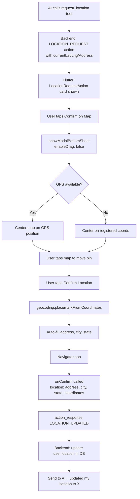
```mermaid
flowchart TD
    A[AI calls request_location tool] --> B["Backend: LOCATION_REQUEST action<br/>with currentLat/Lng/Address"]
    B --> C[Flutter: LocationRequestAction card shown]
    C --> D[User taps Confirm on Map]
    D --> E["showModalBottomSheet<br/>enableDrag: false"]
    E --> F{GPS available?}
    F -- Yes --> G[Center map on GPS position]
    F -- No --> H[Center on registered coords]
    G --> I[User taps map to move pin]
    H --> I
    I --> J[User taps Confirm Location]
    J --> K[geocoding.placemarkFromCoordinates]
    K --> L[Auto-fill address, city, state]
    L --> M[Navigator.pop]
    M --> N["onConfirm called<br/>location: address, city, state, coordinates"]
    N --> O[action_response LOCATION_UPDATED]
    O --> P[Backend: update user.location in DB]
    P --> Q[Send to AI: I updated my location to X]
```

### Routing & Role Separation

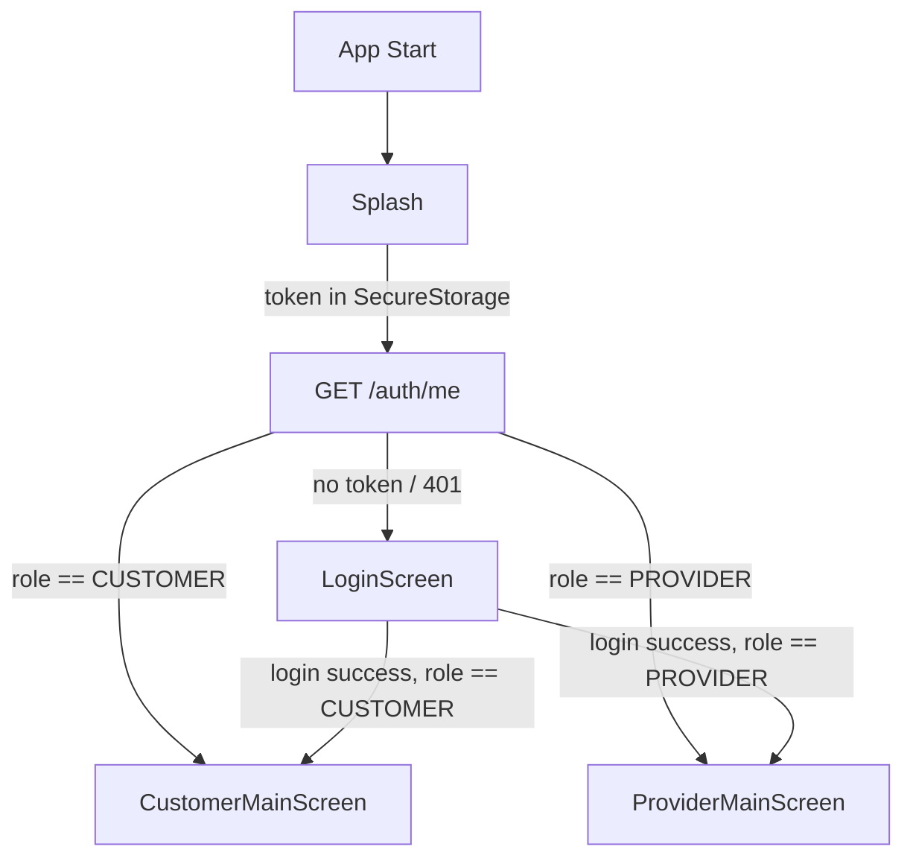
```mermaid
flowchart TD
    App[App Start] --> Splash
    Splash --> |token in SecureStorage| GetMe[GET /auth/me]
    GetMe --> |role == CUSTOMER| CM[CustomerMainScreen]
    GetMe --> |role == PROVIDER| PM[ProviderMainScreen]
    GetMe --> |no token / 401| Login[LoginScreen]
    Login --> |login success, role == CUSTOMER| CM
    Login --> |login success, role == PROVIDER| PM
```

---

## Key Flows

### Full Booking Lifecycle

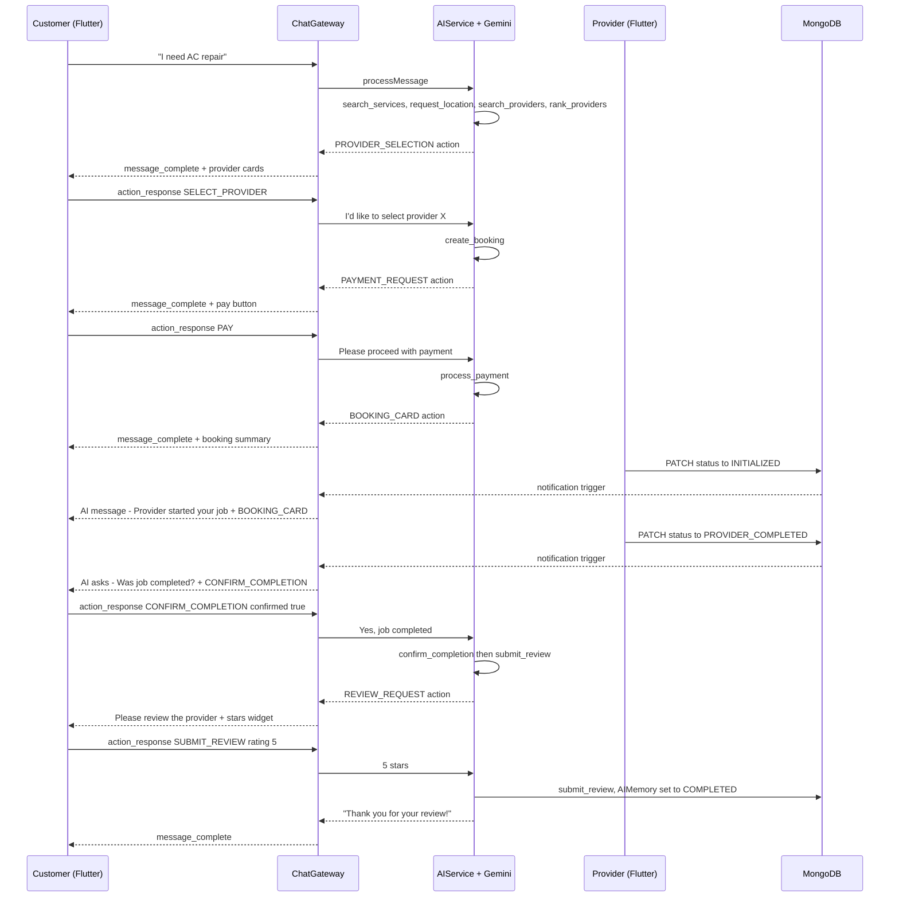
```mermaid
sequenceDiagram
    participant C as Customer (Flutter)
    participant GW as ChatGateway
    participant AI as AIService + Gemini
    participant P as Provider (Flutter)
    participant DB as MongoDB

    C->>GW: "I need AC repair"
    GW->>AI: processMessage
    AI->>AI: search_services, request_location, search_providers, rank_providers
    AI-->>GW: PROVIDER_SELECTION action
    GW-->>C: message_complete + provider cards

    C->>GW: action_response SELECT_PROVIDER
    GW->>AI: I'd like to select provider X
    AI->>AI: create_booking
    AI-->>GW: PAYMENT_REQUEST action
    GW-->>C: message_complete + pay button

    C->>GW: action_response PAY
    GW->>AI: Please proceed with payment
    AI->>AI: process_payment
    AI-->>GW: BOOKING_CARD action
    GW-->>C: message_complete + booking summary

    P->>DB: PATCH status to INITIALIZED
    DB-->>GW: notification trigger
    GW-->>C: AI message - Provider started your job + BOOKING_CARD

    P->>DB: PATCH status to PROVIDER_COMPLETED
    DB-->>GW: notification trigger
    GW-->>C: AI asks - Was job completed? + CONFIRM_COMPLETION

    C->>GW: action_response CONFIRM_COMPLETION confirmed true
    GW->>AI: Yes, job completed
    AI->>AI: confirm_completion then submit_review
    AI-->>GW: REVIEW_REQUEST action
    GW-->>C: Please review the provider + stars widget

    C->>GW: action_response SUBMIT_REVIEW rating 5
    GW->>AI: 5 stars
    AI->>DB: submit_review, AIMemory set to COMPLETED
    AI-->>GW: "Thank you for your review!"
    GW-->>C: message_complete
```

### Provider Cancellation Flow

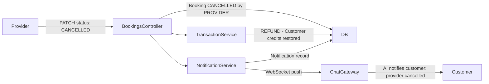
```mermaid
flowchart LR
    Provider -- "PATCH status: CANCELLED" --> BookingsController
    BookingsController -- "Booking CANCELLED by PROVIDER" --> DB
    BookingsController --> TransactionService
    TransactionService -- "REFUND - Customer credits restored" --> DB
    BookingsController --> NotificationService
    NotificationService -- "Notification record" --> DB
    NotificationService -- "WebSocket push" --> ChatGateway
    ChatGateway -- "AI notifies customer: provider cancelled" --> Customer
```

---

## Known Flaws & Limitations

### Critical

| #   | Issue                                                         | Impact                                                                                              | Where   |
| --- | ------------------------------------------------------------- | --------------------------------------------------------------------------------------------------- | ------- |
| 1   | **Hardcoded IP** `192.168.1.5:8000` in `global_constant.dart` | App breaks on any network change                                                                    | Flutter |
| 2   | **No JWT refresh token**                                      | 30-day sessions silently 401 after expiry; user must re-login with no prompt                        | Auth    |
| 3   | **No WebSocket reconnect / message queue**                    | Dropped connection mid-flow loses the AI turn permanently                                           | Flutter |
| 4   | **`rank_providers` IDs not validated**                        | AI could pass arbitrary `providerId` values not from the search results; no server-side cross-check | Backend |
| 5   | **No per-user rate limiting on WebSocket**                    | One user can spam messages and exhaust the Google AI API quota                                      | Backend |

### AI / Logic

| #   | Issue                                 | Impact                                                                         |
| --- | ------------------------------------- | ------------------------------------------------------------------------------ |
| 6   | **Single AIMemory per user**          | No concurrent bookings; mid-flow booking destroyed if user searches again      |
| 7   | **Tool loop has no cycle detection**  | AI can call the same tool 10× in a bad state, silently burning quota           |
| 8   | **`subCategoryName` is free text**    | "AC repair" vs "AC Repair" vs "Air Conditioning Repair" — inconsistent display |
| 9   | **0 providers in 30km → no fallback** | AI just says "none available"; no radius expansion or alternative suggestion   |
| 10  | **Language detection is heuristic**   | System prompt tells AI to detect Urdu/English; can drift mid-conversation      |

### Data / Operations

| #   | Issue                                          | Impact                                                                                                     |
| --- | ---------------------------------------------- | ---------------------------------------------------------------------------------------------------------- |
| 11  | **Deactivated AIMemory records never deleted** | Accumulates indefinitely; no TTL or cleanup job                                                            |
| 12  | **Vector index is manual**                     | Atlas `service_category_vector_index` must be created by hand; no health check or admin warning if missing |
| 13  | **Dispute resolution has no endpoint**         | Disputes freeze payment indefinitely; no admin panel or timeout                                            |
| 14  | **Credits are all-or-nothing**                 | PKR 4,900 credits + PKR 5,000 booking = credits ignored entirely                                           |

### Frontend

| #   | Issue                                          | Impact                                                                           |
| --- | ---------------------------------------------- | -------------------------------------------------------------------------------- |
| 15  | **`BookingDetailsScreen` reads cached state**  | Stale data if booking updated externally; no auto-refresh                        |
| 16  | **No pull-to-refresh on booking details**      | Only the list view has `RefreshIndicator`                                        |
| 17  | **No environment config**                      | No `--dart-define` or flavors; dev/staging/prod all share the same hardcoded URL |
| 18  | **Speech recognition requires full reinstall** | Adding `RECORD_AUDIO` to manifest requires reinstall, not hot reload             |

---

## Tech Stack Summary

| Layer            | Technology                                       |
| ---------------- | ------------------------------------------------ |
| Mobile           | Flutter 3.x, Riverpod (code-gen), Freezed        |
| REST Client      | Dio + `flutter_secure_storage`                   |
| WebSocket Client | `socket_io_client`                               |
| Maps             | `google_maps_flutter`, `geolocator`, `geocoding` |
| Speech           | `speech_to_text ^7.3.0`                          |
| Backend Runtime  | Node.js, NestJS v10                              |
| Database         | MongoDB Atlas, Prisma v6                         |
| AI Chat          | Google Gemini 2.0 Flash (`enterprise: true`)     |
| AI Embeddings    | `gemini-embedding-001` (768 dims)                |
| Vector Search    | MongoDB Atlas Vector Search (cosine similarity)  |
| Real-time        | Socket.IO (`@nestjs/websockets`)                 |
| Auth             | JWT (30-day), Passport, bcrypt                   |
| Package Manager  | Yarn (API), pub (Flutter)                        |
