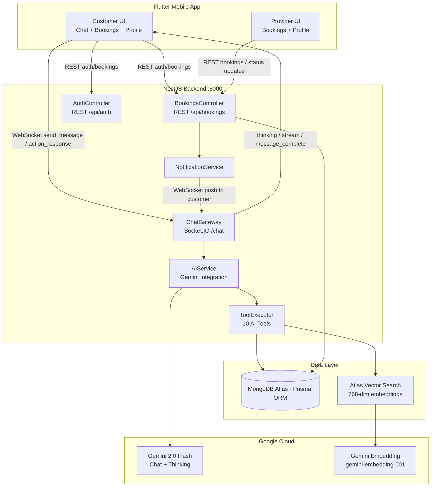
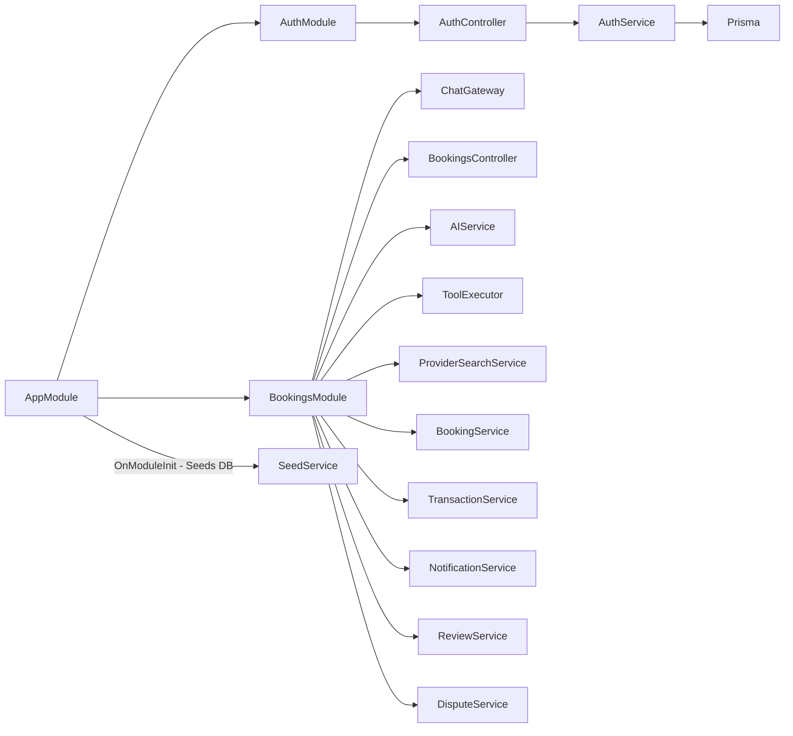
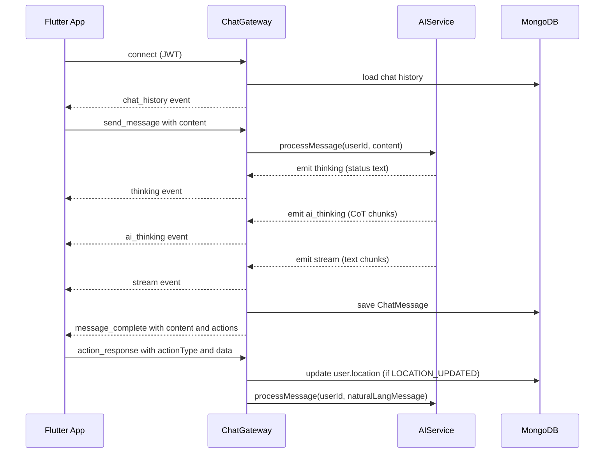
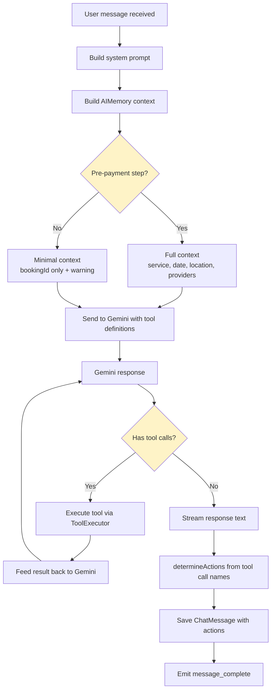
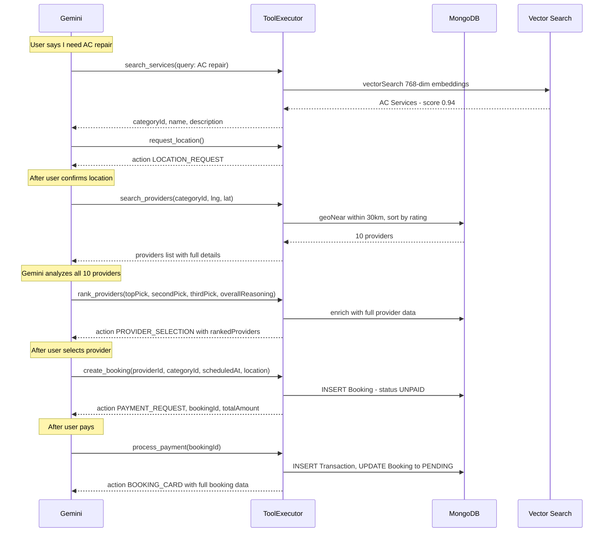
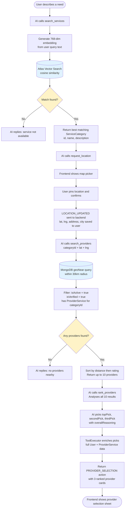

# Services AI — Complete System Design

> **For best diagram rendering, view this file at [https://markdownviewer.pages.dev](https://markdownviewer.pages.dev)**

---

## Table of Contents

1. [Overview](#overview)
2. [High-Level Architecture](#high-level-architecture)
3. [Backend Architecture](#backend-architecture)
4. [AI Agent Design](#ai-agent-design)
5. [Data Model](#data-model)
6. [Frontend Architecture](#frontend-architecture)
7. [Key Flows](#key-flows)
8. [Known Flaws & Limitations](#known-flaws--limitations)

---

## Overview

Services AI is a mobile-first SaaS platform that connects **Customers** (who need home/professional services) with **Providers** (who fulfill them). The entire customer-facing booking journey — from describing a need to reviewing the completed job — is orchestrated by an **AI conversational agent** running in real-time over WebSocket. Providers interact via a standard REST API.

---

## High-Level Architecture

---

## Backend Architecture

### Module Structure

### Guards & Auth Decorators

| Decorator / Guard           | Scope  | Purpose                           |
| --------------------------- | ------ | --------------------------------- |
| `JwtAuthGuard`              | Global | All routes require JWT by default |
| `RolesGuard`                | Global | Checks `@Roles()` metadata        |
| `@Public()`                 | Route  | Skips JWT (signup, login)         |
| `@Roles(UserRole.PROVIDER)` | Route  | RBAC enforcement                  |
| `@GetUser('sub')`           | Param  | Extracts userId from JWT payload  |

### REST Endpoints

| Endpoint                   | Method | Auth     | Description                                      |
| -------------------------- | ------ | -------- | ------------------------------------------------ |
| `/api/auth/signup`         | POST   | Public   | Register customer or provider                    |
| `/api/auth/login`          | POST   | Public   | Login → JWT + user                               |
| `/api/auth/me`             | GET    | JWT      | Current user profile                             |
| `/api/auth/me`             | PATCH  | JWT      | Update profile (name, bio, phone, isActive)      |
| `/api/bookings`            | GET    | JWT      | List bookings (role-filtered)                    |
| `/api/bookings/:id`        | GET    | JWT      | Single booking details                           |
| `/api/bookings/:id/status` | PATCH  | Provider | Set INITIALIZED / PROVIDER_COMPLETED / CANCELLED |
| `/api/bookings/:id/pay`    | POST   | Customer | Mock payment                                     |
| `/api/bookings/:id/review` | POST   | JWT      | Submit review (one per party)                    |

### WebSocket Gateway

Token accepted from **3 sources** on connect:

1. `handshake.auth.token`
2. `Authorization` header
3. `?token=` query param

---

## AI Agent Design

### Processing Pipeline

### Tool Calling Loop (max 10 iterations)

### Provider Discovery Flow

### AI Tools Reference

| #   | Tool                 | Input
