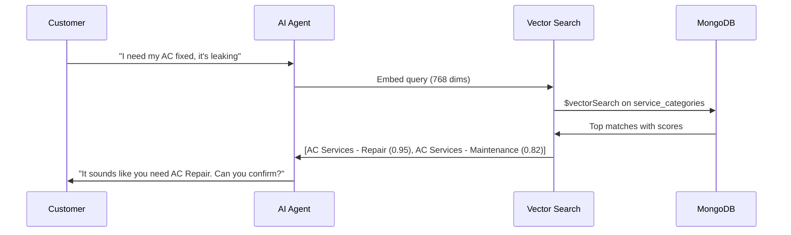

# Vector Search for Service Categories — Implementation Plan

## Goal

Enable the AI agent to semantically match a user's natural language query (e.g., "my AC is making noise and leaking water") to the correct `ServiceCategory` using MongoDB Atlas Vector Search, instead of relying on exact keyword matching.

---

## How It Works

```
User: "I need someone to fix my leaking kitchen faucet"
                    ↓
        Gemini Embedding API
     (converts text → 768-dim vector)
                    ↓
    MongoDB Atlas $vectorSearch
  (finds closest ServiceCategory embeddings)
                    ↓
    Result: "Plumbing Services → Leak Repair" (score: 0.94)
```

---

## Proposed Changes

### 1. Schema Change

#### [MODIFY] `prisma/schema.prisma` — ServiceCategory

Add an `embedding` field to store the vector representation of each category.

```diff
 model ServiceCategory {
   id          String  @id @default(auto()) @map("_id") @db.ObjectId
   name        String
   description String?
   icon        String?
+  embedding   Float[] // Vector embedding (768 dimensions) for semantic search

   parentId String?           @db.ObjectId
   parent   ServiceCategory?  @relation("SubCategories", ...)
   children ServiceCategory[] @relation("SubCategories")
   ...
 }
```

> [!IMPORTANT]
> **Why 768 dimensions instead of 3072?**
> Gemini Embedding models support Matryoshka truncation. 768 dims gives excellent quality for short-text category matching while using **4x less storage** and **faster search** than the full 3072. For ~50-100 service categories, even 3072 would be fine, but 768 is the pragmatic choice.

---

### 2. MongoDB Atlas Vector Search Index

Prisma cannot create vector search indexes. This must be done **manually in MongoDB Atlas** or via a script using the MongoDB driver.

**Index definition** (created in Atlas UI → Database → Search → Create Index → JSON Editor):

```json
{
  "name": "service_category_vector_index",
  "type": "vectorSearch",
  "definition": {
    "fields": [
      {
        "path": "embedding",
        "type": "vector",
        "numDimensions": 768,
        "similarity": "cosine"
      }
    ]
  }
}
```

**Collection**: `service_categories`

> [!IMPORTANT]
> This index must be created on the MongoDB Atlas cluster before vector search queries will work. It can be created via the Atlas UI, the Atlas CLI, or programmatically via the MongoDB Atlas Admin API. It **cannot** be created via `prisma db push`.

---

### 3. Embedding Generation (During Seeding)

When service categories are seeded, each category gets an embedding generated from its name + description.

**Embedding text formula**:
```
"{category.name}: {category.description}"
```

For subcategories:
```
"{parent.name} - {subcategory.name}: {subcategory.description}"
```

**Example**:
- `"AC Services - Installation: Professional installation of split and window air conditioning units"`
- `"Plumbing Services - Leak Repair: Fix leaking faucets, pipes, and water connections"`

This gives the embedding rich context about what the service actually involves.

**Model**: `gemini-embedding-001` with `output_dimensionality: 768`

**API call** (using Google Generative AI SDK):
```typescript
import { GoogleGenerativeAI } from '@google/generative-ai';

const genAI = new GoogleGenerativeAI(process.env.GEMINI_API_KEY);
const embeddingModel = genAI.getGenerativeModel({ model: 'gemini-embedding-001' });

const result = await embeddingModel.embedContent({
  content: { parts: [{ text: "AC Services - Installation: Professional AC installation" }] },
  taskType: 'RETRIEVAL_DOCUMENT',
  outputDimensionality: 768,
});

const embedding: number[] = result.embedding.values;
```

---

### 4. Runtime Vector Search (AI Service)

When the AI detects the user needs a service, it:

1. Embeds the user's query using the same model (but with `taskType: 'RETRIEVAL_QUERY'`)
2. Runs a `$vectorSearch` aggregation via Prisma's `aggregateRaw`
3. Returns the top matching categories with relevance scores

```typescript
async searchServiceCategories(queryText: string): Promise<ServiceCategoryMatch[]> {
  // 1. Generate embedding for user's query
  const queryEmbedding = await this.generateEmbedding(queryText, 'RETRIEVAL_QUERY');

  // 2. Run vector search via Prisma raw aggregation
  const results = await this.prisma.serviceCategory.aggregateRaw({
    pipeline: [
      {
        $vectorSearch: {
          index: 'service_category_vector_index',
          path: 'embedding',
          queryVector: queryEmbedding,
          numCandidates: 20,
          limit: 5,
        },
      },
      {
        $project: {
          _id: 1,
          name: 1,
          description: 1,
          parentId: 1,
          isActive: 1,
          score: { $meta: 'vectorSearchScore' },
        },
      },
    ],
  });

  return results;
}
```

---

### 5. New Dependency

```bash
yarn add @google/generative-ai
```

The project currently has `openai` SDK installed. Since we're switching to Gemini, we'll use Google's SDK for both chat and embeddings.

---

### 6. Environment Variable

Add to `.env`:
```
GEMINI_API_KEY=your_gemini_api_key_here
```

---

## Flow Integration



---

## Open Questions

> [!IMPORTANT]
> **MongoDB Atlas tier**: Vector Search requires Atlas M10+ (dedicated cluster) or M0 with Atlas Search enabled. Does your current cluster support it? The free tier (M0) does support Atlas Vector Search as of 2024.

> [!IMPORTANT]
> **Gemini API Key**: Do you have a Gemini API key ready, or should we set up one? We need it for both the embedding model and the chat model (Gemini 3.0 Flash).

---

## Verification Plan

1. `npx prisma validate` — schema with new field is valid
2. `npx prisma db push` — sync to MongoDB
3. Seed categories with embeddings → verify embeddings are stored (768 floats per category)
4. Create vector search index in Atlas
5. Test a query like "fix my AC" → should return AC-related categories with high scores
6. Test an unrelated query like "hello how are you" → should return low scores
